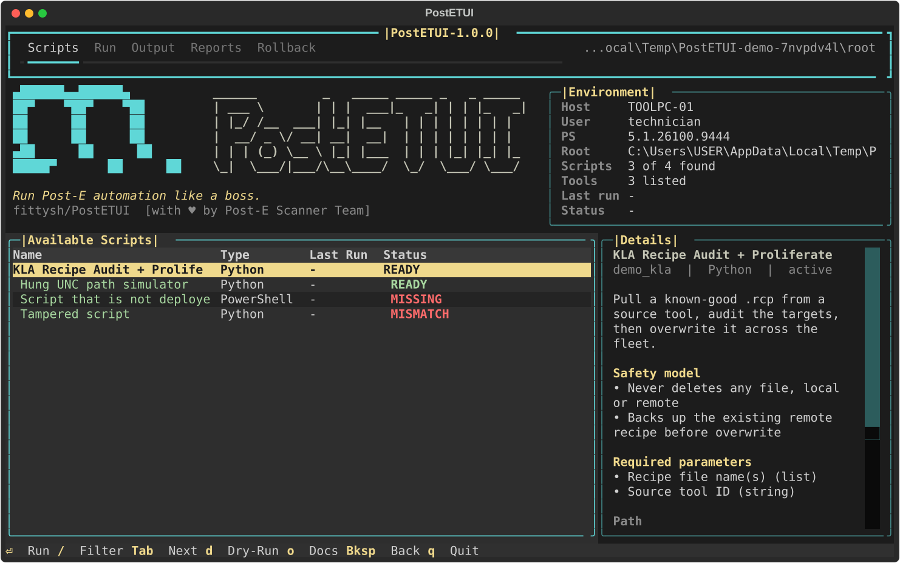
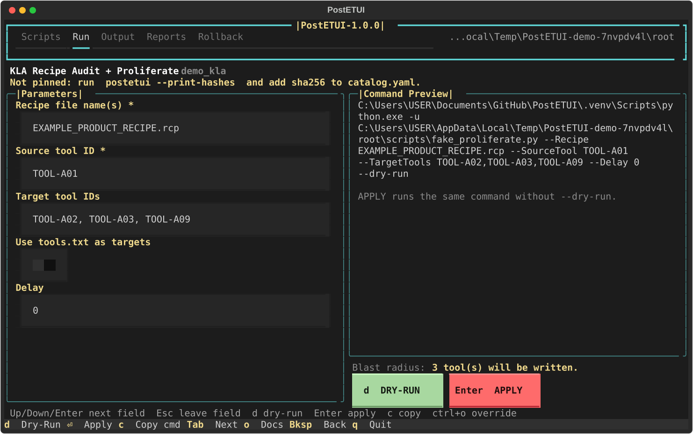
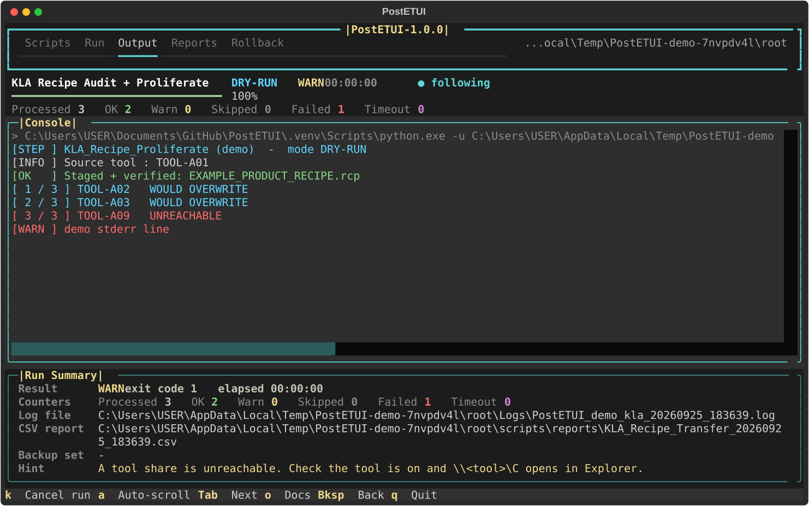
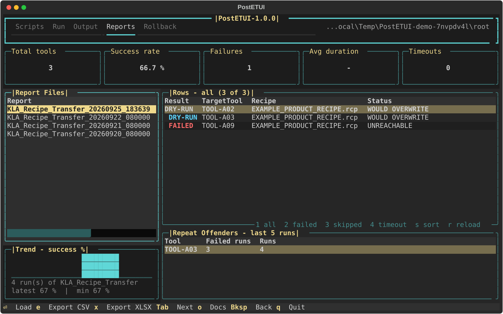
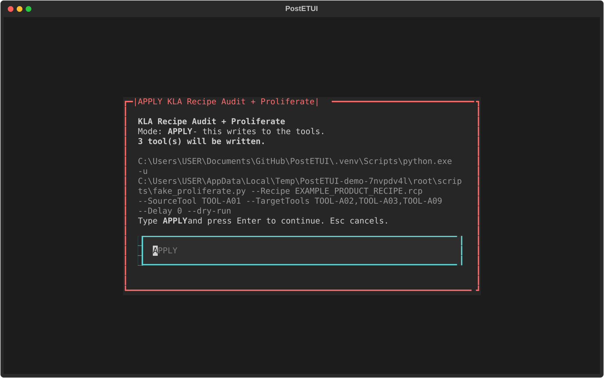
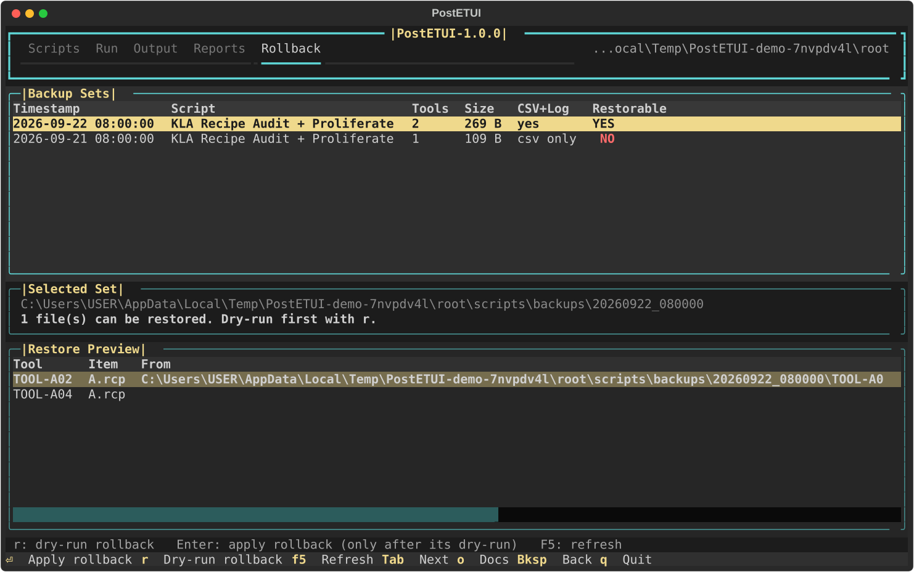

# PostETUI Operator Guide

A run checklist for shift technicians. Follow the steps in order. When a
step says **STOP**, do not continue. Call the process engineer.

The screenshots use demo data. On your PC you will see real tool IDs.

---

## Before you start (once per shift)

1. Make the terminal window big: at least 100 characters wide and 30 lines
   tall. Maximise it. If it is too small, PostETUI shows "Please enlarge the
   terminal".
2. Check that `scripts\tools.txt` lists the right tools, one tool ID per
   line. On the Scripts tab, press `o` for this guide. Press `q` to quit.

---

## 1. Launch

Open a terminal and type:

```
postetui
```



| Area | What to check |
|---|---|
| **Tab bar** (top) | Five tabs: Scripts, Run, Output, Reports, Rollback. Press `Tab` to move between them. |
| **Environment** (top right) | **PS** shows a version such as `5.1...`. If it says `NOT FOUND`, **STOP**. |
| | **Tools** shows how many tools are in `tools.txt`. |
| **Available Scripts** (left) | The **Status** column (see the table below). |
| **Details** (right) | What the script does and its safety rules. |

| Status | Meaning | What to do |
|---|---|---|
| `READY` | Script found and allowed to run | Continue |
| `SUCCESS` / `WARN` / `FAILED` | Result of the last run | Continue |
| `DRAFT` | Entry not finished yet | Do not use |
| `MISSING` | Script file not on this PC | **STOP**. Ask the engineer to deploy it. |
| `MISMATCH` | Script changed since it was approved | **STOP**. Do not override. Call the engineer. |

---

## 2. Select the script

1. Use the `Up` / `Down` arrow keys to highlight the script.
2. Press `Enter`. The **Run** tab opens with the form.

---

## 3. Fill in the form



1. Move between fields with `Up` / `Down`, or press `Enter` to go to the
   next field.
2. Fields marked `*` are required.
3. A red border means the value is wrong. The message under the field tells
   you why.
4. To give many tools, separate them with commas. You can also paste a
   column copied from Excel.
5. Read the **Blast radius** line, for example "3 tool(s) will be written".
   Is that the number of tools you expect? If not, fix the form.
6. The **Command Preview** shows the exact command that will run. Press `c`
   to copy it.
7. Press `Esc` when you are done typing. The form keeps your values for next
   time.

---

## 4. Dry-run first (always)

A dry-run changes nothing on the tools. It shows what **would** happen.

1. Press `Esc` to leave the field, then press `d`.
2. The **Output** tab opens and the script runs.



| Area | Meaning |
|---|---|
| Top line | Script, mode (`DRY-RUN`), status, elapsed time |
| Progress bar | Tools done / total |
| Counters | Processed, OK, Warn, Skipped, Failed, Timeout |
| Console | Live output. Green = OK, yellow = warning, red = failed, cyan = dry-run, grey = skipped. |
| Run Summary | Appears at the end: result, exit code, log file, CSV report, hints |

To stop a run, press `k`. The run is marked `CANCELLED`.

---

## 5. Review the dry-run

1. Read the **Run Summary**.
   - `SUCCESS`: all tools are OK.
   - `WARN`: some tools had problems. See the red lines.
   - `FAILED`, `TIMEOUT` or `ERROR`: **STOP**. Read the **Hint** line, then
     call the engineer.
2. Check every red line in the console, for example `UNREACHABLE`.
   - Is the tool down for PM? Note it, and continue without it.
   - Are you not sure why? **STOP**.
3. To see the CSV report, press `4` (Reports). Press `2` to show failed rows
   only.



---

## 6. Apply

Only apply when the dry-run looked right.

1. Press `2` to go back to the **Run** tab. Your values are still there.
2. Press `Esc`, then `Enter`.
3. A red box shows what will happen and how many tools will be written.



4. Read the box. If it is right, type `APPLY` in capitals and press
   `Enter`. To cancel, press `Esc`.

---

## 7. Verify

1. Wait for the **Run Summary**. The result must be `SUCCESS`, or `WARN`
   with only the tools you expected.
2. Write down the **Backup set** folder shown in the summary. You need it if
   you roll back.
3. Every run is logged automatically: who ran it, on which PC, what it did,
   and the result. You do not need to fill in a separate log.

---

## 8. Roll back (only if needed)

Roll back when the new recipe is wrong on the tools.

1. Press `5` (Rollback).
2. Select the backup set with the time of your run.



3. Check the **Restorable** column.
   - `YES`: continue.
   - `NO`: **STOP**. This set cannot be restored, because it holds no backup
     files. Call the engineer.
4. Press `r` to dry-run the rollback. Check that the lines say
   `WOULD RESTORE`.
5. Press `5` again, select the same set, and press `Enter`. Type `APPLY`
   and press `Enter`.
6. Check that the Run Summary says `SUCCESS`.

PostETUI refuses the real rollback until its dry-run has passed.

---

## Quick keys

| Key | Action |
|---|---|
| `Tab` | Next tab |
| `1`-`5` | Go to Scripts, Run, Output, Reports, Rollback |
| `Enter` | Open the script (Scripts), apply (Run), load (Reports) |
| `d` | Dry-run |
| `Esc` | Leave a field |
| `k` | Cancel the run |
| `o` | Open this guide |
| `q` | Quit |

## When to call the engineer

- The PS line says `NOT FOUND`, or a script shows `MISSING` or `MISMATCH`.
- A dry-run ends `FAILED`, `TIMEOUT` or `ERROR`.
- There are red lines you cannot explain.
- A rollback set shows `NO` under Restorable.
- A message says "Execution policy blocked the script".
